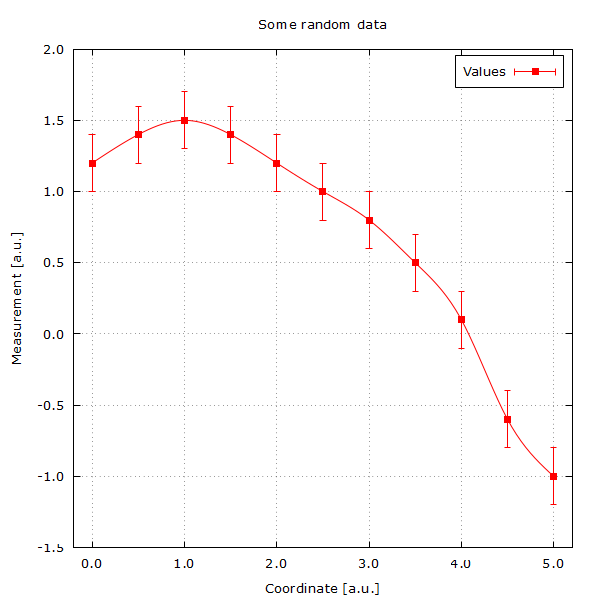

# Gnuplot

*Tested with Gnuplot 5.4 patchlevel 4*

Plotting with Gnuplot generally requires a few steps:

- definition of a terminal and its parameters
- providing output format and file
- giving the axis names and lengths
- adding keys, grids, other elements
- reading and plotting the data

In Gnuplot, a *terminal* is the interface for a given backend implementing the actual plotting process. This implies the type of output format generally. In scientific computing we are generally interested in terminals providing LaTeX support for displaying equations and other symbols. For quick plots we can also use real time rendering (Qt support) or simple PNG-based terminals. For listing all terminals provided with your Gnuplot installation, run `gnuplot` from the command line and type `set terminal` with no further option to get a complete list. Notice that using terminals with LaTeX support requires further compilation of figures and we leave them for a more advanced stage of this series.

For more on Gnuplot, please consider checking [gnuplotting.org](http://www.gnuplotting.org/).

## Basic 2D scientific plot

We start learning Gnuplot with a basic 2D scientific plot. Here we illustrate how to display a dispersion of data points in a pleasing and meaningful way. The main elements that are represented here are the axis labels and title, placement of a meaningful key identifying the data, data points and error bars. No tricks, no overly complicated plot, just plain readable data.

Check the [script](script/01-Basic-2D-Plot.plt) for details. If the data is limited to the context of the figure, *e.g* it is a result of a calculation that is already in its final processed format generated automatically by some compulation, you might want to keep data and plotting routine in a single place. In a second [script](script/02-Basic-2D-Plot-with-Data.plt) we show how to keep data in the plotting file.

    

