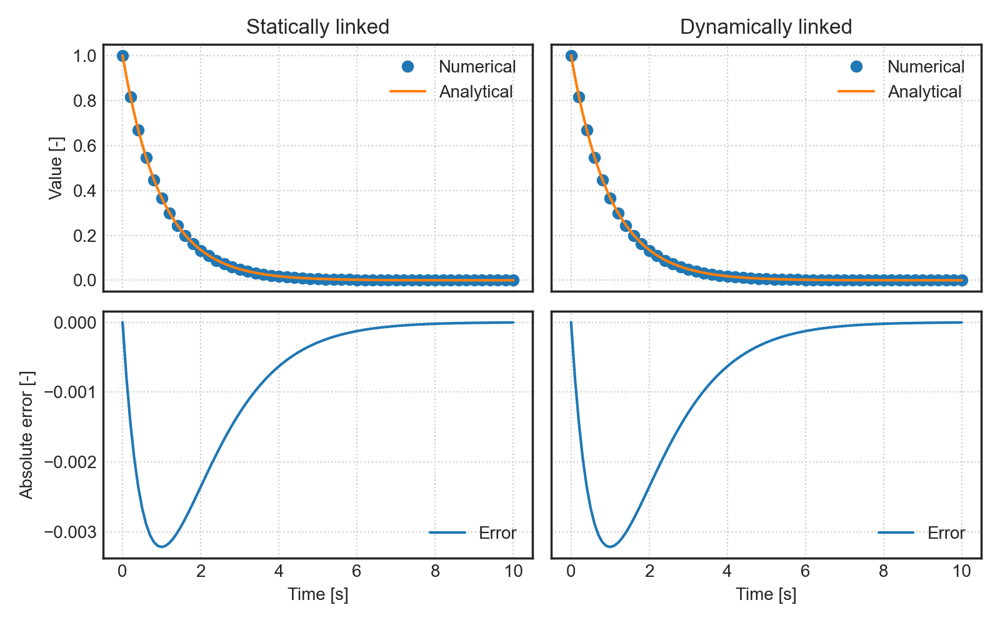

# Runge Kutta 4th order implementation

Pure-C library for solving ODE's with a simple RK4 ODE integrator.

It is intended only for library construction teaching and should not be used for any serious ends, for which validated libraries are available.

## Build

A `Makefile` is provided with basic compilation instructions, also for teaching purposes.

To build the library simply run `make` and it will call the default build.

To build the samples without running them call `make samples`.

To run samples (and compile them) call `make run` which will dump files.

**NOTE:** on Windows Cygwin the compilation produces statically linked executables for both cases.

## Verification

At any time `t` the solution of sample should approach `exp(-t)` and you can check it with `post.py`.

    

