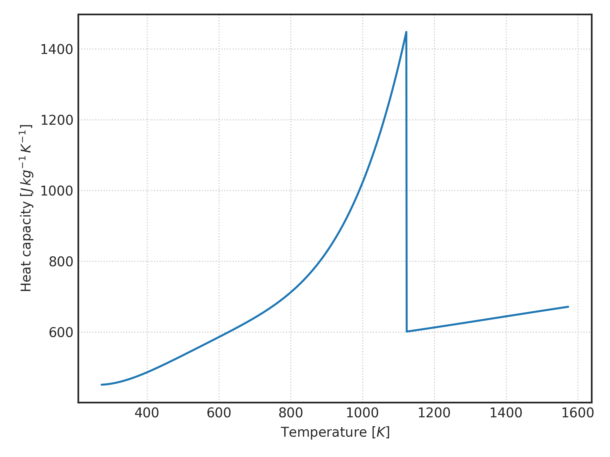
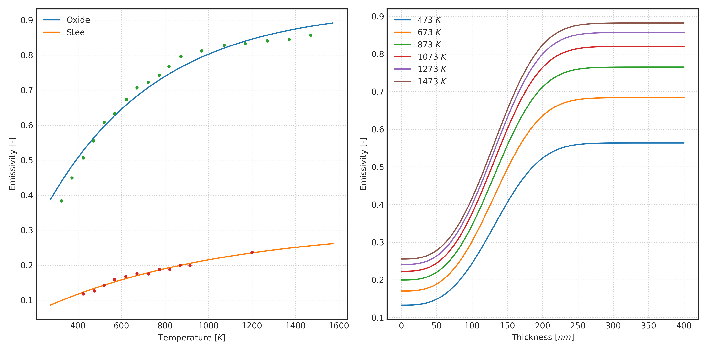

# Oxidation

Simulation of oxide growth over plain iron.

## Usage

Run the program with `stack run --allow-different-user -- <arguments>`,
where the arguments are provided according to the following interface:

```
Usage: oxyl-exe t tk tw l h tc tm yf dy
```

- `t`: initial oxide thickness, typically `1.0e-12`, in meters.
- `tk`: initial steel temperature, in kelvin.
- `tw`: furnace wall temperature, in kelvin.
- `l`: strip thickness, in meters.
- `h`: global HTC, in water per square meters per kelvin.
- `tc`: half the thickness of opaque oxide, typically 1.5e-07, in meters.
- `tm`: exponent used in emissivity interpolation model, typically 3.
- `yf`: duration of heating cycle, in seconds.
- `dy`: integration time-step, in seconds.

## Thermophysical properties

### Steel heat capacity

Steel heat capacity is provided for any generic low alloy composition as
represented by a 2-segment piecewise polynomial. For details check one of
[heat-capacity.py](script/heat-capacity.py) or
[Thermophysical.hs](Thermophysical.hs).

<center>

</center>

### Steel emissivity

Steel emissivity was interpolated between plain iron and iron oxide values
using a sigmoid model. For details check one of [emissivity.py](script/emissivity.py)
or [Thermophysical.hs](Thermophysical.hs).

<center>

</center>
