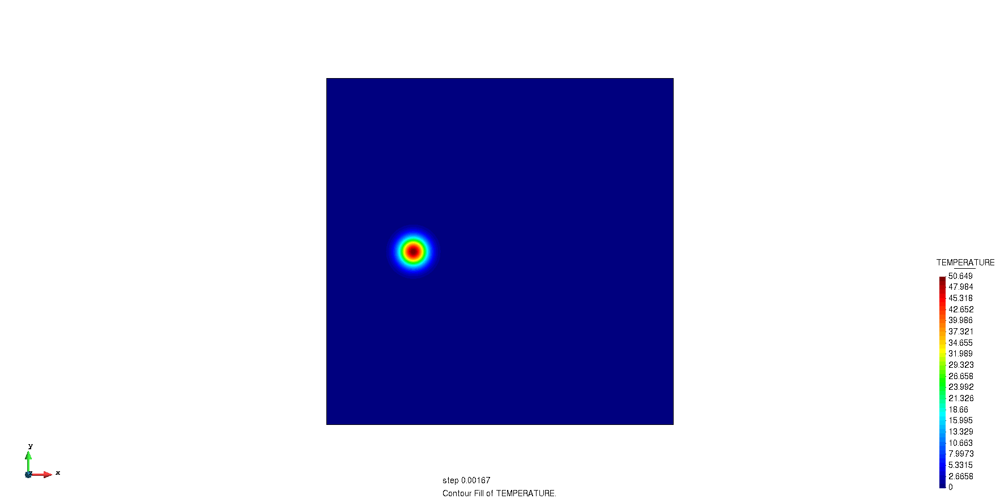

# Convection of a gaussian hill problem

**Kratos version:** 9.1

This is a refactor of validation example by [Riccardo Tosi](https://github.com/riccardotosi) provided [here](https://github.com/KratosMultiphysics/Examples/tree/master/convection_diffusion/validation/gaussian_hill_explicit). It can be run with `python run.py`.

## Case Specification

Implementation is based on [(Kuzmin, 2010)](http://www.mathematik.tu-dortmund.de/~kuzmin/Transport.pdf) pp. 180-184, section 4.4.6.3.

We solve the transient convection equation , where null diffusivity  is considered. Specific initial conditions are set, we refer to the above reference for further details.

The problem is solved exploiting the **Runge-Kutta 4 time integration explicit method**, and it can be run with four different stabilizations:

* quasi-static algebraic subgrid scale (QSASGS)
* quasi-static orthogonal subgrid scale (QSOSS)
* dynamic algebraic subgrid scale (DASGS)
* dynamic orthogonal subgrid scale (DOSS)

## Results

We present the temporal evolution of  for the *DOSS* case.

  

We can observe the results we obtain are consistent with the reference [Donea, J., & Huerta, A. (2003). Finite Element Methods for Flow Problems. Section 5.6.1]. Moreover, we observe the solution peak is not being diffused in the domain, as one should expect for a pure-convection problem.
