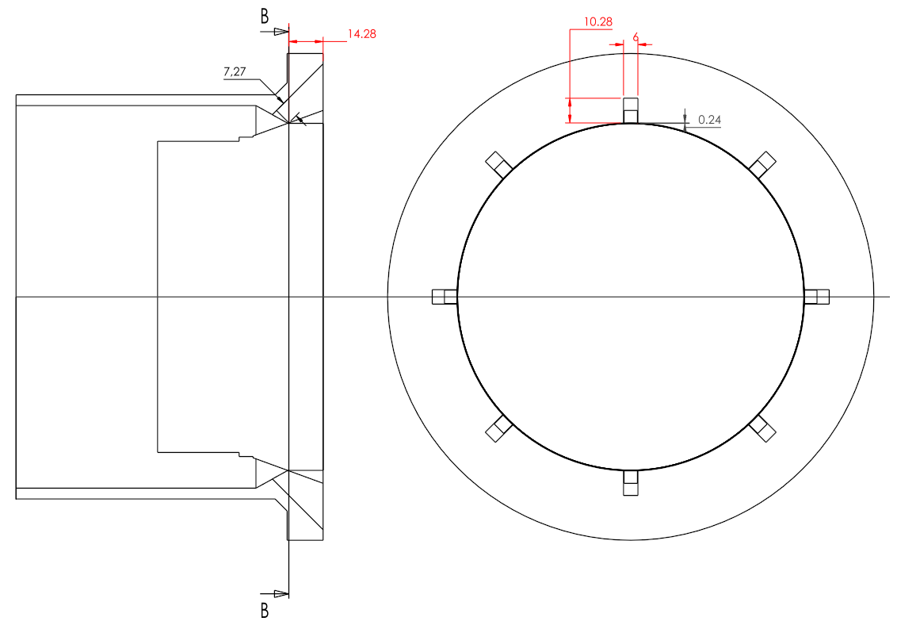

# Simulation of burner nozzle velocity

## Goal

Compute exit angle of ejected gas stream and velocity.

## Conditions

Flow of methane through the nozzle with the following conditions:

| Quantity              | Units | Case A | Case B |
| --------------------- | ----- | ------ | ------ |
| Inlet temperature     | K     | 298.15 | 298.15 |
| Inlet flow rate       | kg/h  | 322    | 48.7   |
| Inlet pressure (ref)  | mbar  | 280    | 20     |

Notice that in 2D cases, since each jet is 6 mm wide, the mass flow rate needs to be scaled for the equivalent value of 1000 mm because of the loss of one dimension. Since there are 8 jets in the burner the value needs to be computed on a jet basis. The actual value for 2D case A is 6708.3 kg/(h.m) and for case B it is 1014.6 kg/(h.m). This is required so that jet velocity is equivalent to 3D cases.

## Hypothesis and equations

- First 2D and then a 3D axisymmetric case.
- Gas flows only through slots (perfect sealing of round surfaces).
- Pure substance (air dilution effects neglected outside nozzle).
- Compressible flow (implied energy equation).
- Turbulence handling with a k-omega SST model.
- No gravitational effects.

**NOTE:** there is a small gap of 0.24 mm in the round surface considered with perfect sealing, but modeling this through CFD would require a prohibitively large grid and other complications associated with the compressible conditions. This was already taken into account in 2D boundary conditions calculations.

## Validated tools

- Cantera 2.6.0
- gmsh v4.9.5
- SU2 v7.4.0

## Material properties

Since high velocities are present, a compressible ideal gas law is used for density.

Other propeties are reported in the following figure (Cantera + Gri-Mech 3.0).

 .")

## Geometry

Geometry was provided in a DWG file and reconstructed with Space Claim. All cases will be run with same geometry of perfectly aligned nozzle setting, as provided in the figure below.

 

## Solution meshes

For the present case two types of meshes were conceived: a first set used for setup presenting only the outlet channel and a second set with an external medium for allowing gas expansion. Each type of mesh was produced in a 2D and 3D version. All 2D versions were extruded 1-cell-thick (1 meter) so that meshes can be reused with OpenFOAM for verification.

## Solution cases

- [case-00-2d-steady](cases/case-00-2d-steady) 2D simulation of **Case A** at steady state.
- [case-01-3d-steady](cases/case-01-3d-steady) 3D simulation of **Case A** at steady state.
- [case-02-2d-steady](cases/case-02-2d-steady) **FAIL** 2D simulation of **Case B** at steady state.
- [case-03-2d-steady](cases/case-03-2d-steady) **FAIL** same as [case-02-2d-steady](cases/case-02-2d-steady) but a slightly higher inlet pressure because the previous did not reach the target mass flow rate.
