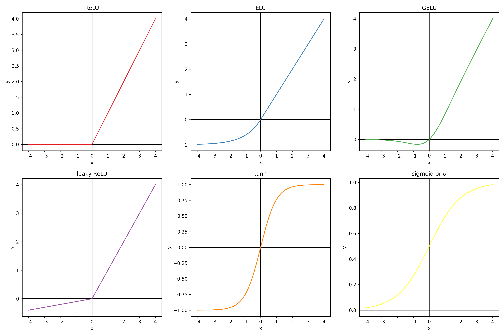

# Introduction to machine learning

Machine learning is often described as having an algorithm "learn" from "data".
More pragmatically it always consists in adjusting the parameters of a parametric model (for example the weights of a linear regression model) to maximize a numerical criterion representing the model's fitness for its task (for example, minimize the model's sum of squared errors for regression), using an optimization algorithm (gradient descent for example).
This is essentially the same definition as fitting a statistical model. The term "machine learning" emerged when the advance of computational powers allowed to move from very simple model for which the parameters maximizing the fitness criterion had an analytical solution, to more complex models which required stepwise optimization methods. Hence the learning part of machine learning, as "training" of the model could take a lot of time while the model was becoming increasingly better at it's task.

## Physics : a first example of parametric model

Physics is the science of describing the laws of our universe. It is the pioneer discipline that introduced the usage of mathematical parametric models: equations that take inputs, produce outputs, and depend on adjustable parameters.

Physics models remained mostly qualitative before Newton. For example, the trajectory of a canonball was approximated with simple geometrical shapes, and there existed Nomograms of the trajectory for several initial angles of the canon.

The first truely quantitative physical model was introduced with differential calculus by Isaac Newton (1643 - 1727):

$$
m \times \frac{\partial \vec{V}}{\partial t} = m \times \vec{g} + C \times \vec{V}^2
$$

This model is a parametric model that take as input the velocity, and gives the acceleration.
The parameters of the model are g the gravity acceleration constant, m the mass of the canonball, C the drag coefficient, and V0 the initial velocity at exit of the muzzle. The parameters of this physical model were determined independently by specially crafted experiments. For example, timing the fall of a marble of neglectible drag gives g. Weighting the canonball gives m. The drag coefficient C for a sphere of same diameter can be measured from the terminal velocity of a sphere made of a lighter material like paper. And finally, measuring the distance traveled by the canonball gives its initial velocity.

## Best fitting parameters

Measuring the value of each parameter independently with specialy crafted experiment is not always possible. Because sometimes parameters cannot be decoupled from each other, or new experiments cannot be freely done. Another alternative is to adjust all the parameters at once to best fit to the observations.

In the previous example, lets assume we have measurements of the trajectory of a canonball. We could adjust the parameters to obtain the best possible fit of the predicted trajectory with the experimentally measured trajectory.

This kind of approach was first publicated by Adrien-Marie Legendre in *Nouvelles méthodes pour la détermination des orbites des comètes* in 1805. He applied this method to find the equation of the conic best describing the trajectory of a comete. For his application, Legendre formalized the "best fit" as the set of parameters which minimizes the sum of square deviations between model and measurement points. The square in this criterion gives an higher weight to big errors, and takes the absolute value of the errors so that they can't compensate each others. This was coined as the least squares method.

For some specific cases, the sum of squared errors admits a single minimum and no maximum. Consequently the zero of its derivative with regards the parameters gives the best fiting set of parameters: the best fit is given by an analytical solution. Legendre notably gave an analytical solution of the optimum parameters (in the least squares sense) for linear model.

## Numerical optimization

Because it is not always possible analyticaly, optimization algorithms aim at finding numericaly the minimum of a function (often only a local minimum) in as few evaluations as possible. Under the heavy influence of numerical optimization in economics modeling, this function that we want to minimize is called the loss function or sometimes cost function.

### Gradient descent algorithm

The most commonly used optimization algorithm is the gradient descent algorithm, first publicated by Augustin-Louis Cauchy in *Compte Rendu à l'Académie des Sciences* in 1847. The loss as a function of other parameters can be seen as an hyper-surface we want to find the minimum of. The idea of the gradient descent is to start from an initial position of random parameters, and follow the slope of the cost function toward a local minimum.

The gradient is the vector of derivatives of the loss function with regards to each of the model's parameters. It points in the uphill direction, so we make small displacements in the parameters space, in the direction opposed to the gradient. In practice this displacement is usualy chosen as a factor called learning rate that multiplies minus the gradient. The gradient is function of the parameters and so must be updated at each step.

In this animation we fit a linear function y=a*x+b to some data points. In the left panel we represent the data points in blue, the fitted curve in green, and the deviation between observation and prediction in red. The loss to minimize is the sum of the squared lengths of the red segments.
On the right panel, we ploted values of the sum of squared error (the loss) as a function of the parameters a and b. The black dots are the positions in the parameters space. In this two-parameters case, the gradient descent can be viewed as following the slope of a 3D surface and can be visualized.

Idealy an analytical expression of the gradient should be used, otherwise the derivative of the loss $L$ with regards to each parameter $p_i$ can be approximated numerically as $\frac{\partial L}{\partial p_i} \approx \frac{L(p_i + \epsilon) - L(p_i - \epsilon)}{2 \epsilon}$ thanks to the definition of the derivative. However settings epsilon too high gives a bad approximation, and setting it too small gives numerical error during evaluation. Consequently the gradient descent might be less stable, and it is also more computationally intensive as there needs to be as many evaluation of this expression as there are parameters in the model to compute the full gradient.

The scale of the parameters is important for this algorithm. If the optimal parameters have different orders of magnitude, the learning rate might be too big for small parameters (oscilate around the optimum value) or too small for the big parameters (the parameters will take a prohibitively long number of steps to reach a satisfying value). In an atempt to give the same order of magnitude to the parameters, the inputs are often normalized to all have the same order of magnitude. Sometimes intermediate results are normalized as well, especially in deep learning. Some variations of the gradient descent, such as the Adam algorithm, try to mitigate this scaling issue by adaptatively scaling the gradient's vector components.

Additionaly it is to be noted that this algorithm might not find a solution close to the global minimum of the loss function as it might get stuck in a bassin: a local minimum. For this reason this algorithm might find a different solution depending on initialization of the parameters. There are variations of the gradient descent algorithm that aims at beeing robust to these local minimum, such as the bassin-hoping algorithm, or adding momentum to the gradient descent. However in machine learning the most used models are well behaved numericaly and local minima usualy have performance nearly equal to the global minimum. For this reason the random initialization doesn't matter in practice.

### Genetic algorithm

Another less often used optimization algorithm is the genetic algorithm optimization (John Holland 1960). It is inspired for the theory of evolution. The vector of all the parameters of the model is assimilated to the genetic code of an individual. The criterion to optimize for is
a "fitness score" of the individual to its environment that we want to maximize.

We start with a random parameters vector. At each step we create "childs" copies of the previous state, with  the addition of random noise representing the mutations. Only the best fitted child is selected at the end. There exist a lot of variations, some more complex involving keeping the n best fit at each generation, or performing "matings" by mixing the parameter vectors of couples of individuals. Just like in gradient descent algorithm, the scale of the optimal parameters is important (because the amplitude of the random noise is usualy the same for all parameters). Input variables are usually normalized as well.

This algorithm is less often used than gradient descent because it usually requires more function evaluation to obtain the same results, due to the fact that displacements are random and not guided by a "slope". However it has the advantage of handling non-diferentiable cost functions and integer parameters natively.

## Universal approximators and overfiting

Thanks to numerical optimization we can fit any parametric model to observations. However finding an adequate mathematical model for each practical case would be an inefficient approach. Some universal approximators (parametric models that can approximate any function on a finite set of points by as closely as wanted) are used instead. Usualy, the number of parameters of these models can be adjusted, and increasing the number of parameters increases the expressive power of these models.

Beeing able to adjust the expressive power of the model is an advantage. Having too much expressive power can hurt generalization capability of the model. Because the model learns noise specific to the training data sample and not a general trend in the data. This is called overfitting. 

In this animation, a polynomial of increasing order is fited to a set of training data. Another set of data called the test data is put aside an not used during training. The performance of the model can be evaluated on the test data, which is representative of the performance of the model on new data points. As we can see the higher the polynomial's order, the better is the loss on the training data. However, at one point, the model ends up performing worse than before on the test data.

The standard practice is to shuffle all available data and to split them in two groups: train data and test data. Usualy the number of test data are chosen as 20% of the total. The train dataset is used to train the model, and the test dataset is used to compare several types of models between them and to report on performances. For time series where samples close from each other in the time line are likely to be highly correlated, the data are not shuffled.

The evaluation of the performance on the test set will likely vary from one random split to another. The k-fold method gives a more repeatable evaluation of the performance of the model, but also more computationaly expensive. The data is split in k subsets of data (with k usualy chosen as 3 or 5). The k models are trained separately, each one tested on a different test subset, and trained on the remaining subsets. The 

The parameters that are chosen once and not changed during training (degree of the polynomial, number of iterations of optimization method, ...), are called hyper-parameters of the model. Hyper-parameters are usualy adjusted manually until finding satisfactory results, because exhaustive grid search approaches are too computationaly expensive. The standard practice to choose the value of the hyper parameters is to split the data in a train set and a validation set, in addition to the test set. Models are trained on the train set for several set of hyper parameters. The set of hyperparameters that performs best on the validation set is chosen. Then the performance of the model is evaluated on the test set.

## Machine learning tasks for tabular data

The most common application of machine learning is to train a model on tabular data. Each row is an observation, each column is an input variable $X_j$ or a target value $Y$. There are two most common tasks on this kind of data: regression and classification. Regression is when the model has to predict a numerical value for each observation, classification is when the model has to predict a class (amongst a fixed set of possible classes) for each observation.

The usual loss function used for regression is the sum of squared error:

$$
L = \sum_i (Y_i - \hat{Y}_i)^2
$$

With $\hat{Y}_i$ the prediction of the model for the $i^{th}$ observation, and $Y_i$ the corresponding target. While for classification, assuming the model yields a probability $\hat{p}_i^c$ for each observation index $i$ and class index $c$, and with $p_i^c$ the target probability (1 if observation $i$ is of class c, 0 otherwise), the usual loss function is the negative log likelyhood (also called cross entropy):

$$
L = \sum_i \sum_c \left(-\mathrm{log}(\hat{p}_i^c) \times p_i^c \right)
$$

In addition, sometimes some class weighting is added to this loss to counteract the bias induced by class imbalance.

## An overview of some commonly used models

In this section we will describe some commonly used machine learning models for application to tabular data.

We will fit each regression model on 1000 noisy observations from the function

$$
y = \mathrm{exp}\left( \left(\frac{X_1-0.5}{0.3} \right)^2 + \left(\frac{X_2-0.5}{0.3}\right)^2 \right) - \mathrm{exp}\left( \left(\frac{X_1+0.5}{0.3} \right)^2 + \left(\frac{X_2+0.5}{0.3} \right)^2\right)
$$

And each classification model will be fitted on 500 random samples from each of two gaussian distributions:

### Linear and polynomial regression

Linear models are models of the form y = a1 \* x1 + ... + an \* xn + b.
This include polynomials of any order if we set xi = x^i. Sometimes interaction terms of the form xi\*xj are also added, as well as any custom numerical feature.
This kind of models have the advantage to have an analytical solution for the parameters that minimize the sum of squared errors to observations, which means training is orders of magnitude faster than other type of models. Linear models (polynomials of order one) also have the advantage to be simple enough that its parameters can be interpreted. Althought this is always dangerous with correlated inputs as the values of the optimum parameters can be extremly sensitive to noise. For example an increased weight can be compensated by a reduced weight from another highly correlated variable.

Polynomials are in theory universal approximators (see Lagrange polynomial interpolation). In practice they generalize poorly to new data, especially with high polynomial orders. And as illustrated below its expressive power scales poorly with polynomial order. Even for a simple 1D function such has the absolute value. For this reason this kind of models are usualy restricted to linear models or low order polynomials. They are used alone to describe low complexity functions, as piecewise linear function or piecewise polynomials for more complex functions (for example NASA polynomials fitted to describe thermodynamic parameters).

The fitting of our test function gives the following result:

There also exist variations of the linear regression which minimize other loss functions. Ridge regression consists in minimizing the sum of squared error plus a chosen positive factor that multiplies the L2 norm (euclidian norm) of the parameters vector (also called L2 penalization). This tends to reduce the expressiveness of the model by scaling down towards zero all weights and bias equaly. The lasso regression replaces the L2 penalization by L1 penalization (L1 norm of the parameters vector: the sum of their absolute values) which tends to penalize towards zero the weigt of the less impactant variables. And finally the Elastic net variation that cumulates L1 and L2 penalization with two different multiplying factors.

$$
L = \alpha \times \left\lVert \vec{P} \right\rVert_{1} + \beta \times \left\lVert \vec{P} \right\rVert_{2} + \sum_i (Y_i - \hat{Y}_i)^2
$$

The multiplying factors $\alpha$ and $\beta$ in the loss are hyper parameters that need to be adjusted so that the model best fit the validation data. These types of models are more robust against outlayers than standard least square regression. As all penalization terms, it is a tradeoff of model expressiveness for generaliation power. These penalization terms can be added to the loss of any model.

### K nearest neighbours

The k nearest neighbours model was invented in 1951 by Joseph Hodges. It is an interpolation method from labeled observations rather than a parametric model. The Y value of a new observation is given by the average (sometime weighted by inverse distance) of the Y of the k closest labeled observations, with the integer k an hyperparameter of the model (usualy 3 or 5). It is an universal approximator by definition if the obsevations are weighted by inverse distance or if k is 1, because then it predicts without any error all the training observations.

This model has the advantage of beeing easy to interpret, as for a new observation it identifies similar points already labeled. It can be used for regression as well as classification and requires no training.
The evaluation on test data gives the following results:

### Decision tree

Decision tree are models that consist in successive binary splits of the training data using threshold criterion on input variables. The leafs of the obtained tree are associated to a constant prediction value, either a class for classification or a numerical value for regression. For classification, the class predicted at a leaf is the most frequent class amongst training data in this leaf. For regression, the numerical value predicted at a leaf is the average of the target values amongst training data in this leaf. If we make enough splits, there will be only one training observation in each leaf, which proves that this model is an universal approximator. To avoid reaching this state of overfitting, a maximum number of split can be chosen as an hyper-parameter. Sometimes there are additional stoping criteria such as the maximum depth of the tree, and the minimum number of sample in a leaf to allow the split.

During training the tree is expanded step by step by splitting one of the leafs in two at each step. There is a finite number of ways of spliting a set of observations in two groups with a threshold on an input variable (because we only consider thresholds at mid-distance between two distinct consecutive values of the variable). There is a finite number of input variables to split on. Consequently there is a finite number of ways of spliting a leaf of the tree. During training, all possible splits of all leafs are explored and scored. The next split chosen at each step is the split that scores best. This greedy algorithm doesn't ensure that the split are chosen optimaly for the final result, but exploring all possible trees would be prohibitively slow. For regression, the score chosen is usualy the reduction of mean squared error of the model (which simplifies to the difference between initial set variance and the average of variance of the two new sets). For classification, the score is usualy chosen as the reductions of the cross entropy of the model (which simplifies to the difference between cross entropy of the initial set and the sum of the cross entropy of the two new sets).

Decision tree have the advantage of needing no data normalization whatsoever, as they are not trained using an optimization method. The results of the model are easy to understand as the decision process for a prediction is a succession of conditions. They are also relatively robust to sparse data as even for regions with no close training observations, the evaluation of the model will remain in a reasonable range thanks to the constant prediction values. Another advantage of decision trees for regression is that the splits can be constrained for the model to be monotonously increasing or decreasing along specified input variables.

The training on the test data give the following results.

## Gradient boosting

Gradient boosting was first publicated by Jerome H Friedman in *Greedy Function Approximation: A Gradient Boosting Machine* in 1999.

The general idea behind gradient boosting regression is to define a model that is a sum of shallow decision tree regressors. The sequence of decision tree is extended by training a new decision tree with as target the error of the gradient boosting model at the previous step. Thus it gradually corrects its own error on the training data as the number of decision trees grow. The resulting model generalizes better to unseen data than a deep decision tree regressor, while remaining an universal approximator.

In practice a scaling factor between 0 and 1 (usualy 0.1) called learning rate is applied to all decision tree predictions. This factor is an hyperparameter and improves generalization power when tuned correctly. Also the model starts from an initial guess $\hat{y}_0$ chosen as the average $y$ of all training observations to speed up training.

This training process can be interpreted as a gradient descent in the function space. The function update can be written as:

$$
\hat{y}^{n} = \hat{y}^{n-1} + lr \times \hat{\delta}^{n-1}
$$

with $lr$ the learning rate, and $\hat{\delta}$ an approximation of the function $\delta = (y - \hat{y})$ by a shallow decision tree regressor. The derivative of the sum of squared error loss with regard to the prediction of the model $\hat{y}_i$ for each observation $i$ is:

$$
\frac{\partial L}{\partial \hat{y}_i} = \frac{\partial}{\partial \hat{y}_i} \left( \sum_j \left( \hat{y}_j - y_j \right)^2 \right) = 2 \times \left( \hat{y}_i - y_j \right) = -2 \times \delta_i
$$

Consequently the function update can be interpreted a gradient descent, with minus two times the gradient approximated by a decision tree regressor.

The expression of the update could be derived similarly for other loss functions. Notably, we can build a gradient boosting classifier from several gradient boosting regressors $\hat{y}_c$, and the cross entropy loss. By defining $1_{i \in c}$ the function that evaluates as 1 if the $i^{th}$ observation is in the class $c$ and 0 otherwise, the gradient is expressed as:

$$
\delta_{c,i} = -\frac{\partial}{\partial \hat{y}_{c,i}} \left( \sum_j 1_{j \in c} \times - \mathrm{log} \left( \frac{\mathrm{exp} \left( \hat{y}_{c,j} \right)}{\sum_k \mathrm{exp} \left( \hat{y}_{k,j} \right)} \right) \right)
$$

$$
\delta_{c,i} = -\frac{\partial}{\partial \hat{y}_{c,i}} \left( 1_{i \in c} \times \left( \mathrm{log} \left( \sum_k \mathrm{exp} \left( \hat{y}_{k,i} \right) \right) - \hat{y}_{c,i} \right) \right)
$$

$$
\delta_{c,i} = 1_{i \in c} \times \left(1 - \frac{\mathrm{exp} \left( \hat{y}_{c,i} \right)}{\sum_k \mathrm{exp} \left( \hat{y}_{k,i} \right)}\right)
$$

Hence the update rule for each individual regressor $\hat{y}^n_c = y_c^{n-1} + lr \times \hat{\delta}_c$. With $\hat{\delta}_c$ a decision tree regressor fitted to the residual probability for observations that are part of the class $c$, and zero otherwise. The initial guess $y_c^0$ can be chosen as 0 for all $c$.

The gradient boosting model has all the advantages of the decision tree model excepted for the interpretability. It however usualy performs better. The training of a gradient boosting model on test data gives the following results:

## Feed forward neural network

Feed forward neural networks (also called multi layer perceptron) are a type of neural network that can be used for regression or classification from tabular data, and is usualy trained with gradient descent. It was first publicated by  McCulloch Warren and Walter Pitts in *A Logical Calculus of Ideas Immanent in Nervous Activity* in 1944. It was originaly intended as a simple biologival model of a brain. It is usualy represented in the following form:

The model is organised in layers. Each circle represents an intermediate numerical value, also called neuron. The blue circles are the input variables. The red circle are the hidden layers' neurons. The green circle is the predicted output. It is possible to have several outputs if several scalars should be predicted at once. For classification for example there is one output neuron per possible target class, and the prediction of the model is the class with the neuron most activated (highest numerical value). The calculations of the neurons' values are done from left to right (hence why it is sometimes called a feed forward neural network). Each neuron is connected to all the neurons of the previous layer by some synapses, indicating that each neuron depend exclusively on all the neurons of the previous layer (hence why it is sometimes called a fully connected neural network). The mathematical expression of a neuron is:

$$
X_{i,j} = f \left( b_{i,j} + \sum_k a_{i,k,j} \times X_{k, j-1} \right)
$$

This is essentially a linear function of the neurons of the previous layer, to which an activation function $f$ is applied. With $f$ chosen non linear, otherwise the whole neural network simplifies to a linear model. The activation function is usually the same for the whole network, excepted for the outputs, which usualy have no activation function unless we want to add some specific constraint to them. For example, in classification, the softmax function is applied to the outputs to convert the values between -inf and +inf to probabilities (between 0 and 1, such that the sum of the outputs is 1). The softmax function takes the exponential of each output (to have strictly positive values) and divide them all by the sum of the exponential of all outputs (so that they sum up to 1). Here below are some usual activation functions. From experience, ReLU is always a good default choice.

Visualizing how a single neuron reacts to modifications of the parameters helps to understand the choice of its mathematical formulation. Let's consider a neuron with two inputs X1 and X2 that we will note $\vec{X}$. The mathematical expression of its output can be equivalently formulated as $y = f\left( (\vec{X} + \vec{b}) \cdot \vec{a}\right)$. If $f$ is the tanh function, the resulting function is a wave in the direction of $\vec{a}$. Modifying the amplitude of $\vec{a}$ changes the slope of the wave. Changing the bias $\vec{b}$ gives a position offset to the wave.

In this two inputs case it is intuitive how a linear combinations (with a bias) of such waves could approximate any 3D surface, hence any function with two inputs. In a more general manner the universal approximation theorem is a proof that feed forward networks with a single layer can approximates any function given enough neurons in the hidden layer. Experimentaly it is observed that using several hidden layers instead of a single one with many neurons can help the model to generalize a litle bit better.

The feed forward neural networks, like all neural networks, have the advantage of allowing the computation of the loss' gradient with the backpropagation method. The model consists in a composition of differentiable operations. The chain rule of derivatives gives us an expression of the derivative of a composition of functions. If all the intermediate results can be stored in memory, and an analytical solution of the jacobian matrix is known for all intermediate operations, then the gradient can be backpropagated from the loss to all the parameters. This computation time needed for the backpropagation is of the same order of magnitude as the forward pass of the loss evaluation. This makes the training of neural networks very scalable with parameters count.

The fitting of feed forward models with 3 hidden layers of 50 neurons and ReLU activation gives the following results on our test datasets:

## Visualizing model performances

After training a model it can be usefull to visualize the result of the model on test data to give a qualitative estimation of the model performance and to diagnosis when the model didn't train correcly. For regression model it can be usefull to visualize a prediction/target scatter plot. If the model is perfect, all points are on the y=x axis.

For classification it can be usefull to plot a confusion matrix. The row index indicates the class predicted by the model, and the columns indicates the target classes. If the prediction is perfect 100% of the predictions should be in the diagonal.

For quantitative performance evaluation it is often a good idea to use an intuitive metric in addition to the value of the loss. For regression it is usual to compute an R² metric ($1 - \frac{\sum_i (y_i - \hat{y}_i)^2}{ \textrm{var}(y) }$) or the pair of mean error and standard deviation of error. For classification usual metrics are the accuracy (fraction of good predictions over all observations), the precision (for each target class, number of observations correctly labeled as part of the target class divied by number of observations labeled as part of the target class), the recall (for each target class, number of observations correctly labeled as part of the class divided by number of observations in the target class), and the F1 score ($2\times \frac{\textrm{precision}\times \textrm{recall}}{\textrm{precision} + \textrm{recall}}$).

## Features selection

There is one hyperparameter that we did not discuss yet, and that is common to all models: the subset of variables to use as inputs for the model. The choice of the variable depends firstly of our understanding of the context. Only the variables that are supposed to be correlated to predicted target should be included (and only those that we can measure before making a new prediction, for practical reasons).

Sometimes however we are not sure what variables should be included. In this situation, it is recommended to use a feature selection method. Either forward selection: start from n=0 variables, train a model with all combinations of n+1 variables, permanently add the most impactant each time, or backward selection: start from all and remove the least impactant. There should be a stoping criterion on the performance gain/loss. Another feature selection method is to give an impact score to all variables, called feature importance, and to select only the most impactant variables. A feature importance method that works for all types of model is the permutation feature importance. The delta of performance between training the model normaly and training after having a column of inputs shuffled gives the feature importance of the input variable. There are other model specific feature selection methods. For example linear model have probalist interpretation on the significance of each weight/bias under some assumptions. Linear model can also be trained with increasing L1 penalization to see in which order the parameters will faint to zero. Finally gradient boosting and decision trees can give a feature importance for all variables in one training by cumulating for each variable splited on the information gain (variance reduction or cross entropy reduction) of each split.

## Beyond tabular data

In real life applications we sometimes have non tabular data we would like to apply the model on.

### Image analysis

Images for example can be interpreted as tabular data with as many input columns as there are pixels times the number of chanels in the image. However with this approach the model would need to learn independently to recognize the same paterns at eahc position of the image. This would require prohibitively big quantities of training data. For this reason machine learning scientist have been using convolutional filters to extract features from images in a shift invariant manner. Here below an animation taken from [here](https://github.com/vdumoulin/conv_arithmetic) of how convolution of a filter works:

The filter is applied on each chanel of the image separately. The value of each pixel of the image chanel and filter are multiplied by each other and summed to give one pixel of the newly obtained feature map. For application to feature extraction, the maximum value of the feature map is selected. This scalar number represents the feature associated to a filter and a chanel of the image.

The filters can be generated from families of filters such as the Gabor filters, and only a subset of the features will effectively be used by the model after feature selection.

Nowadays specialised convolutional neural networks are the dominant type of model used in this field of application. Because image analysis requires powerfull model, and neural networks scale very well thanks to parallelization on graphical processing units.

### Text analysis

To convert text of various sizes to tabular data with a fixed number of columns, the usual methodology is to create a bag of word representation. One must define a vocabulary of words that the model will know. The text is then represented as the frequency of each word of the vocabulary in the observation text (often normalized by the frequency of the same word in usual language). Thus the number of features is fixed to the size of the vocabulary, whatever the length of the text. Similarly it is recommended to perform feature selection on this type of tabular data.

Nowadays 1D convolutional neural networks, recurent neural networks and transformers (another type of neural network) are most used for this type of data.

### Time series analysis

Time series are tables of observations and target where the target is supposed to depend on features of the rpevious lines as well. The usual method to convert to tabular data is to copy the input features of previous lines as additional features of the current line, on a limited number lines back. This is equivalent to what a 1D convolutional network does. Missing values (at the start of the time series) should be replaced by a default value or these samples should be discarded.